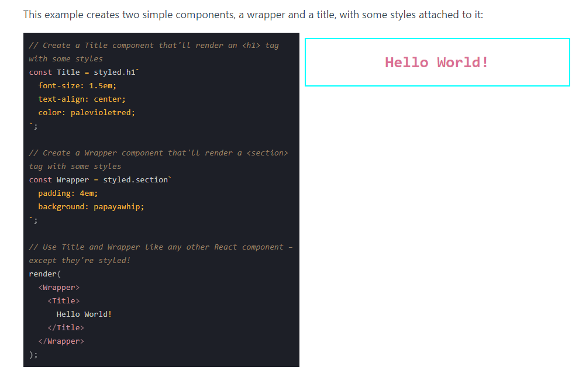

# What is styled components

## Link docs

<https://styled-components.com/docs/basics>

Styled-components is a library for React and React Native that allows you to use component-level styles in your application that are written with a mixture of JavaScript and CSS. ... styled-components allows React developers to write plain CSS in React components without having to worry about clashing of class name

## Getting Started

## Adapting based on props

## Theme

...

## Demo

<https://study-styled-component-2pzlg9w8m-khanh-sc.vercel.app/>
